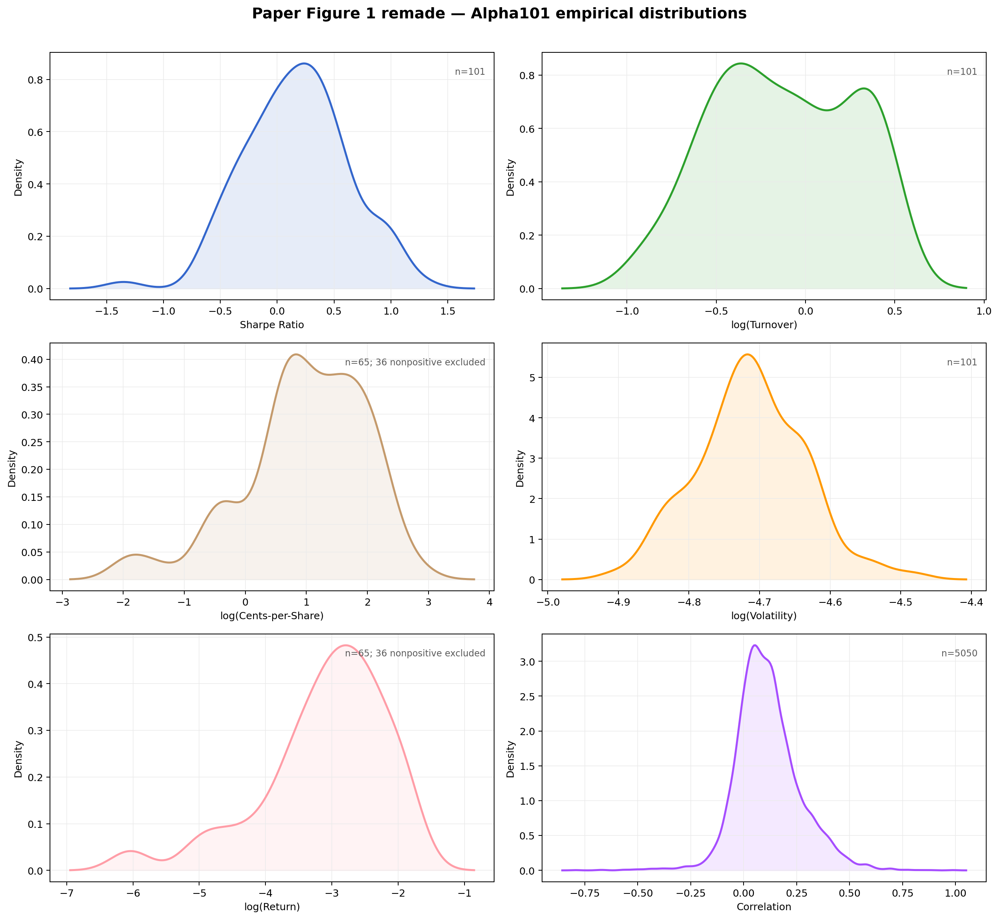
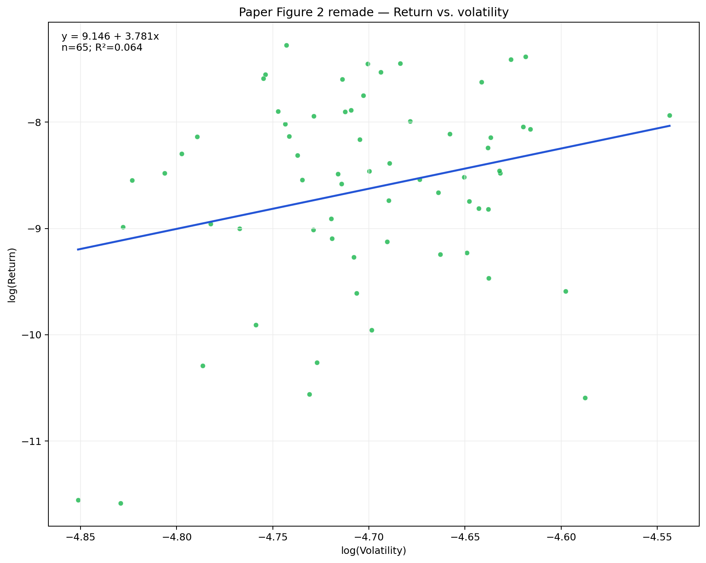
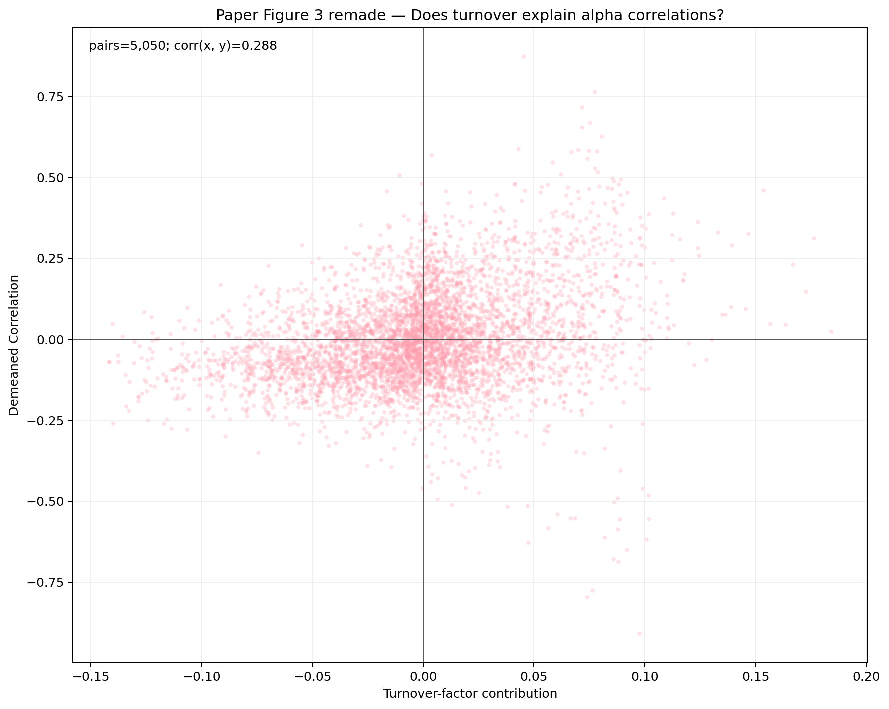
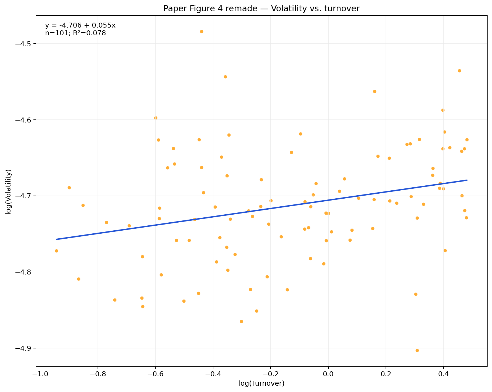
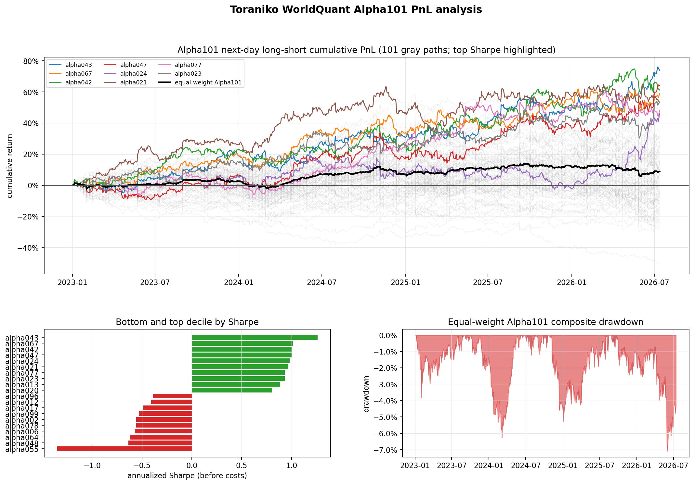
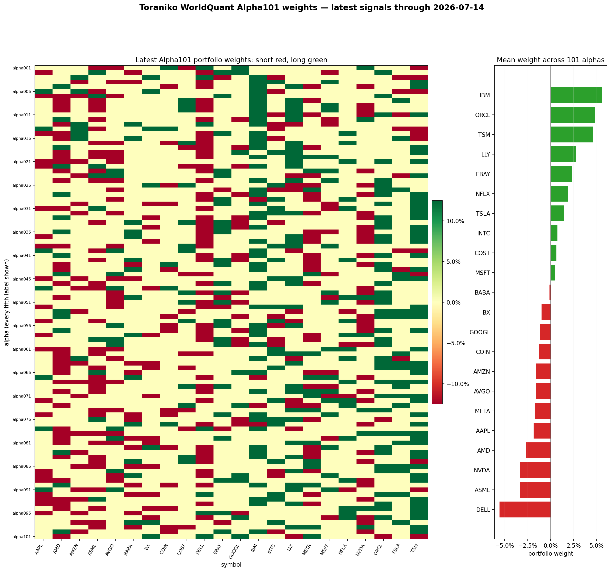

# toraniko-alpha101

An independent implementation and audit of all 101 formulaic alphas from the WorldQuant paper,
integrated with Toraniko's long-form Polars factor framework.

- Official paper: [101 Formulaic Alphas (PDF)](https://arxiv.org/pdf/1601.00991)
- Formula implementation: [`toraniko/alpha101.py`](toraniko/alpha101.py)
- Formula and neutralization audit tests: [`toraniko/tests/test_alpha101.py`](toraniko/tests/test_alpha101.py)
- PnL and IC analysis: [`toraniko/alpha101_report.py`](toraniko/alpha101_report.py)
- Reproducible report runner: [`examples/alpha101_report.py`](examples/alpha101_report.py)

This project is research software. It is not affiliated with WorldQuant and is not investment
advice. Reported returns exclude transaction costs and are not live trading results.

## Current Alpha101 report

Dataset: 22 liquid equities, 2023-01-03 to 2026-07-14. Yahoo adjusted OHLCV; typical price
proxies daily VWAP; point-in-time shares are used for market cap. Classification labels are a
fixed research taxonomy.

Method: signals at *t*, next-session underlying-equity returns at *t+1*, equal-weight top/bottom
quintiles, 50% long and 50% short. Returns exclude costs. No formula feature selection is
applied: all 101 alphas are analyzed independently, and the black composite line equally weights
all available alpha return streams.

Alphas analyzed: 101

### Highest Sharpe alphas

| Alpha | Ann. return | Ann. vol | Sharpe | Max DD | Rank IC | Turnover |
|---|---:|---:|---:|---:|---:|---:|
| alpha043 | 17.46% | 13.83% | 1.262 | -10.87% | 0.0186 | 57.88% |
| alpha067 | 14.64% | 14.43% | 1.014 | -9.53% | 0.0211 | 66.28% |
| alpha042 | 14.71% | 14.68% | 1.002 | -11.98% | 0.0101 | 47.41% |
| alpha047 | 15.67% | 15.66% | 1.000 | -14.57% | 0.0193 | 44.81% |
| alpha024 | 15.26% | 15.54% | 0.982 | -18.16% | 0.0240 | 31.21% |
| alpha021 | 13.23% | 13.68% | 0.967 | -17.77% | 0.0134 | 41.88% |
| alpha077 | 12.76% | 13.67% | 0.934 | -13.39% | 0.0045 | 33.71% |
| alpha023 | 13.53% | 14.53% | 0.931 | -14.50% | 0.0182 | 51.49% |
| alpha013 | 12.64% | 14.24% | 0.888 | -15.26% | 0.0109 | 38.92% |
| alpha020 | 12.33% | 15.31% | 0.806 | -14.80% | 0.0132 | 79.12% |
| alpha005 | 10.88% | 14.40% | 0.756 | -16.84% | 0.0119 | 55.11% |
| alpha073 | 9.37% | 13.77% | 0.680 | -22.78% | 0.0141 | 50.04% |
| alpha070 | 9.47% | 14.31% | 0.662 | -18.76% | 0.0126 | 63.01% |
| alpha093 | 9.32% | 14.26% | 0.654 | -15.50% | 0.0066 | 20.61% |
| alpha053 | 8.95% | 14.03% | 0.638 | -19.49% | 0.0130 | 80.48% |
| alpha086 | 8.31% | 13.82% | 0.601 | -14.79% | 0.0036 | 45.54% |
| alpha016 | 8.53% | 14.75% | 0.578 | -10.54% | 0.0070 | 38.99% |
| alpha068 | 7.38% | 13.20% | 0.559 | -24.83% | 0.0061 | 48.72% |
| alpha022 | 7.41% | 13.85% | 0.535 | -16.37% | 0.0076 | 46.17% |
| alpha052 | 9.01% | 16.88% | 0.534 | -15.48% | 0.0213 | 34.27% |

### Lowest Sharpe alphas

| Alpha | Ann. return | Ann. vol | Sharpe | Max DD | Rank IC | Turnover |
|---|---:|---:|---:|---:|---:|---:|
| alpha055 | -19.38% | 14.35% | -1.350 | -51.19% | -0.0067 | 40.41% |
| alpha048 | -7.51% | 11.79% | -0.637 | -25.90% | -0.0028 | 67.76% |
| alpha064 | -8.23% | 13.33% | -0.617 | -30.97% | -0.0017 | 25.54% |
| alpha006 | -8.27% | 14.50% | -0.570 | -38.56% | 0.0065 | 31.75% |
| alpha078 | -7.92% | 14.23% | -0.557 | -26.86% | -0.0145 | 33.13% |
| alpha002 | -7.10% | 12.77% | -0.556 | -28.24% | -0.0052 | 37.59% |
| alpha099 | -6.65% | 12.49% | -0.532 | -34.72% | -0.0045 | 25.53% |
| alpha017 | -7.53% | 15.54% | -0.484 | -46.15% | -0.0078 | 80.61% |
| alpha012 | -6.03% | 14.83% | -0.407 | -29.99% | 0.0017 | 71.41% |
| alpha096 | -5.45% | 14.01% | -0.389 | -26.42% | 0.0072 | 34.93% |
| alpha098 | -5.22% | 13.62% | -0.383 | -35.24% | -0.0086 | 28.84% |
| alpha081 | -4.63% | 12.62% | -0.367 | -28.13% | -0.0039 | 25.50% |
| alpha088 | -5.17% | 15.54% | -0.333 | -26.21% | 0.0095 | 26.94% |
| alpha033 | -5.55% | 17.02% | -0.326 | -28.34% | 0.0075 | 78.41% |
| alpha072 | -4.05% | 12.58% | -0.322 | -19.93% | -0.0013 | 29.66% |
| alpha097 | -4.32% | 13.62% | -0.317 | -28.77% | 0.0052 | 30.19% |
| alpha063 | -4.28% | 13.88% | -0.308 | -23.92% | -0.0061 | 24.32% |
| alpha058 | -4.05% | 14.12% | -0.287 | -23.27% | 0.0036 | 49.07% |
| alpha038 | -4.05% | 15.55% | -0.260 | -36.77% | 0.0098 | 68.19% |
| alpha060 | -3.80% | 14.68% | -0.259 | -22.80% | -0.0007 | 73.37% |

### Cross-alpha diagnostics

- Median annual return: 2.75%
- Median Sharpe: 0.188
- Median rank IC: 0.0065
- Median one-sided turnover: 43.43%

### Paper figures remade with current data

Figures 1-4 from the official [*101 Formulaic Alphas* paper](https://arxiv.org/pdf/1601.00991)
are reproduced below with this report's 2023-01-03 through 2026-07-14 data. The definitions
follow Section 3 of the paper: turnover is gross daily dollars traded per dollar of gross
investment, and cents-per-share is 100 times mean daily PnL divided by mean daily shares traded
(buys plus sells).

- Mean / median pairwise alpha-return correlation: 0.1149 / 0.0995 across 5,050 pairs
- `log(Return) ~ log(Volatility)`: slope 3.781, R² 0.064, 65 positive-return alphas
- Adding `log(Turnover)` to that regression: coefficient 0.027, t-stat 0.083
- Turnover-tensor correlation model: R² 0.083 across 5,050 alpha pairs
- `log(Volatility) ~ log(Turnover)`: slope 0.055, R² 0.078

The 36 nonpositive return and CPS observations are excluded only from panels requiring a natural
log. Signals are not flipped and absolute values are not substituted.









The full regression table and methodology are in
[`reports/alpha101_paper_figures.md`](reports/alpha101_paper_figures.md). Reusable results are in
[`reports/alpha101_paper_metrics.csv`](reports/alpha101_paper_metrics.csv),
[`reports/alpha101_pairwise_correlations.csv`](reports/alpha101_pairwise_correlations.csv), and
[`reports/alpha101_paper_regressions.csv`](reports/alpha101_paper_regressions.csv).

### PnL and weights





The machine-readable diagnostics are in
[`reports/alpha101_analysis.csv`](reports/alpha101_analysis.csv), and the standalone generated
report is retained at [`reports/alpha101_analysis.md`](reports/alpha101_analysis.md).

## Reproduce the report

The data acquisition step is deliberately kept outside the factor library. Supply a wide
Yahoo-format OHLCV parquet and the point-in-time share caches used by the Toraniko HIP-3 example.

```bash
pip install -e .
pip install -r examples/hyperliquid_hip3/requirements.txt

PYTHONPATH=. python examples/alpha101_report.py \
  --ohlcv /path/to/alpha101_ohlcv.parquet
```

The runner regenerates the Markdown/CSV analyses, PnL and weight charts, and all four paper-style
Matplotlib figures under `reports/`.

## Implementation notes

- All 101 formulas are exposed through `factor_alpha101(...)` in a Toraniko-compatible long-form
  `date × symbol` panel.
- Fractional lookbacks follow the paper's floor convention.
- Time-series ranks, rolling correlations, linear decay, conditional formulas, and warm-up
  behavior have dedicated tests.
- The formulas that prescribe sector, industry, or subindustry neutralization are checked against
  an explicit neutralization manifest.
- Daily VWAP is approximated by typical price in this report because the Yahoo daily panel does
  not contain true intraday VWAP.

For the underlying Toraniko factor-model documentation, see
[`README.toraniko.md`](README.toraniko.md). The original HIP-3 repository is
[`OctopusTakopi/toraniko-hl-hip3`](https://github.com/OctopusTakopi/toraniko-hl-hip3).
