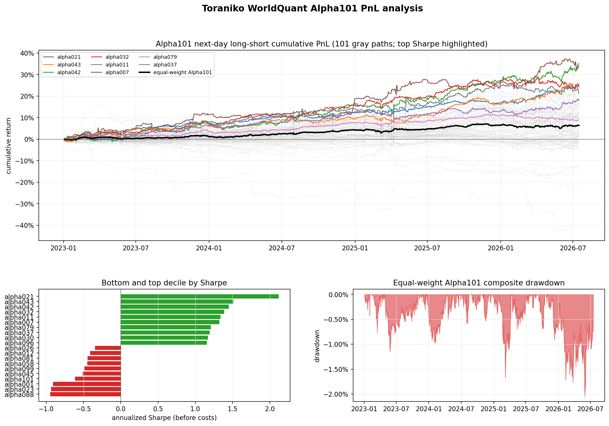
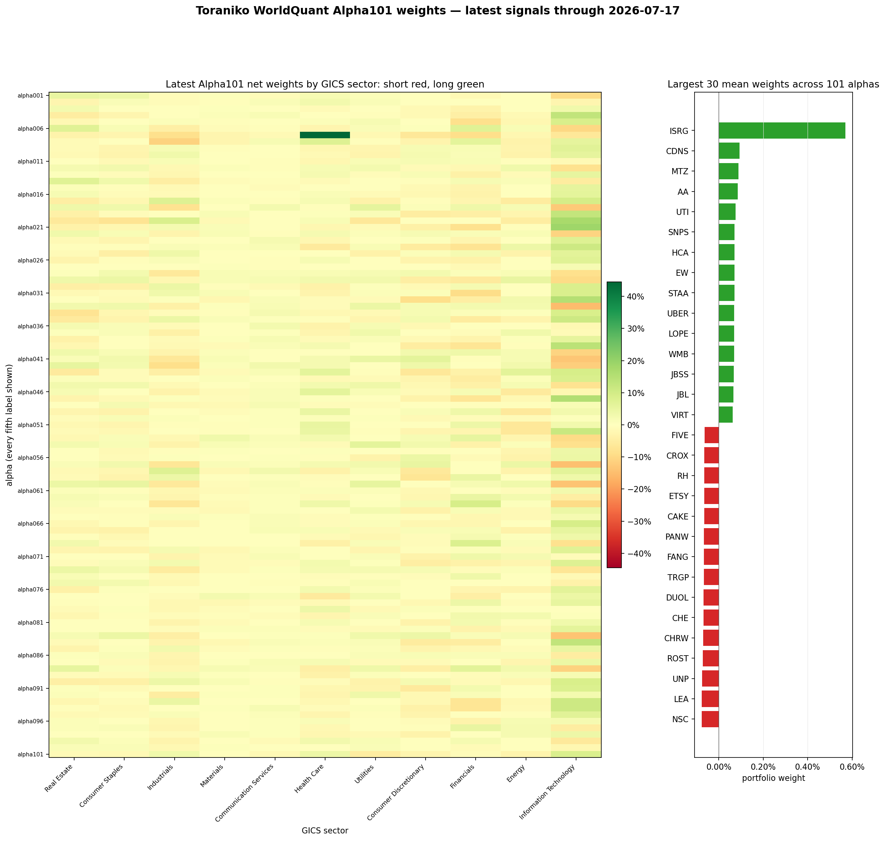
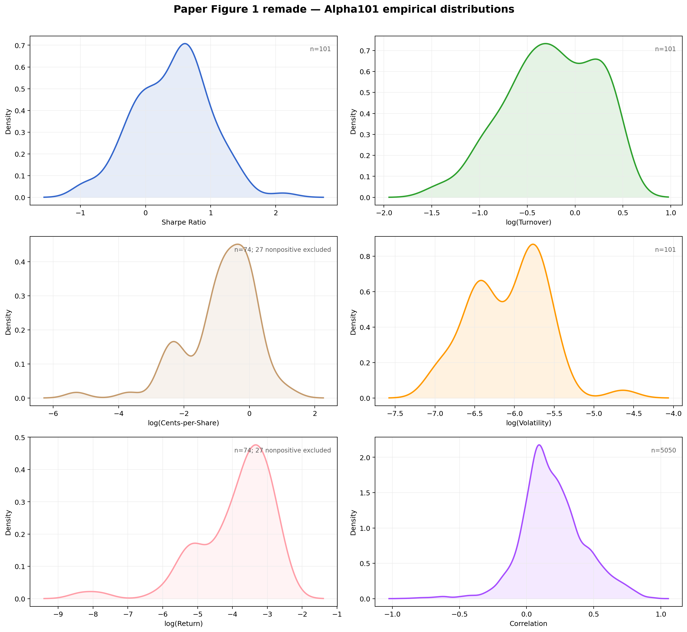
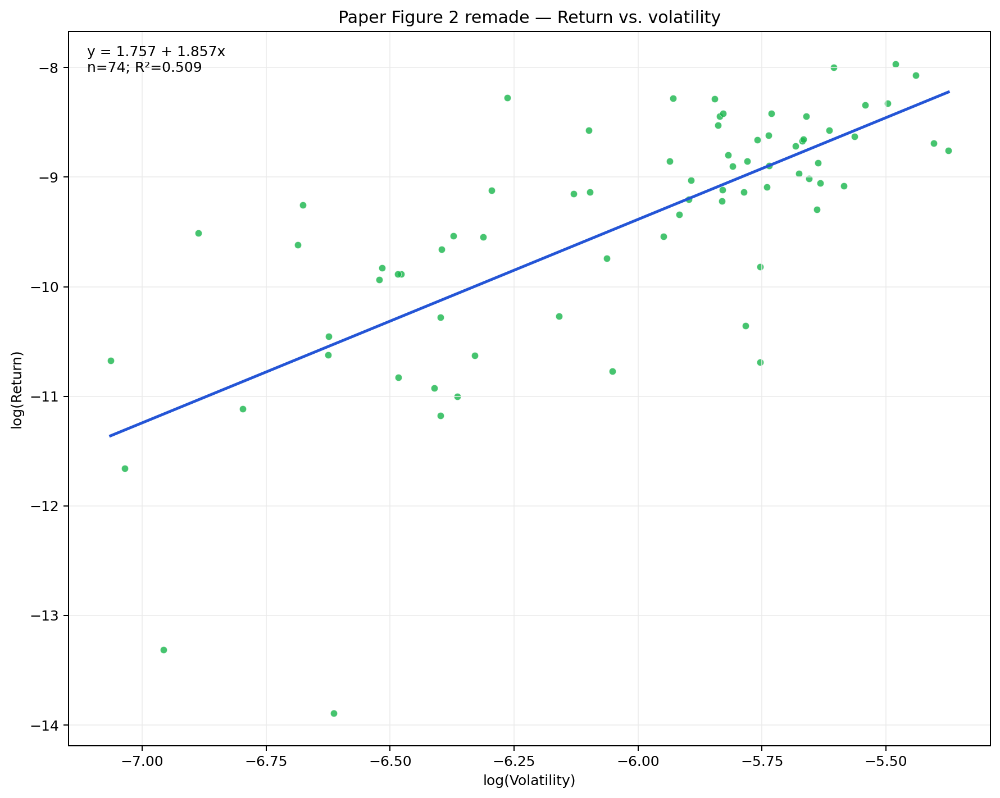
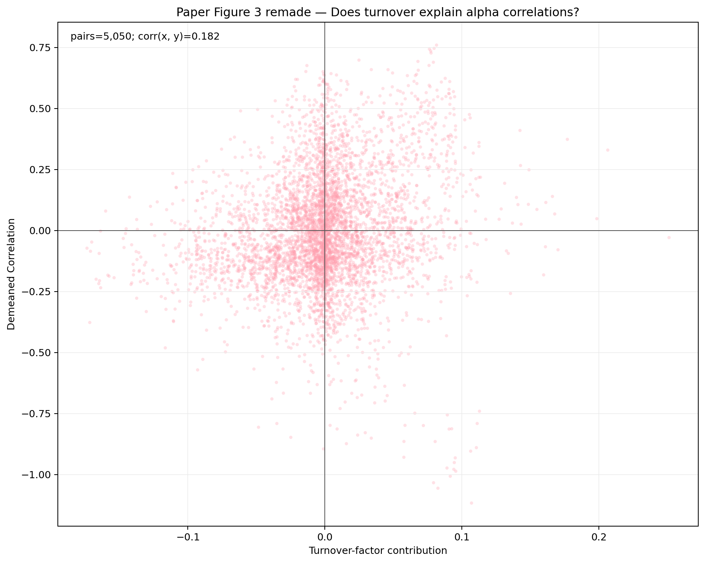
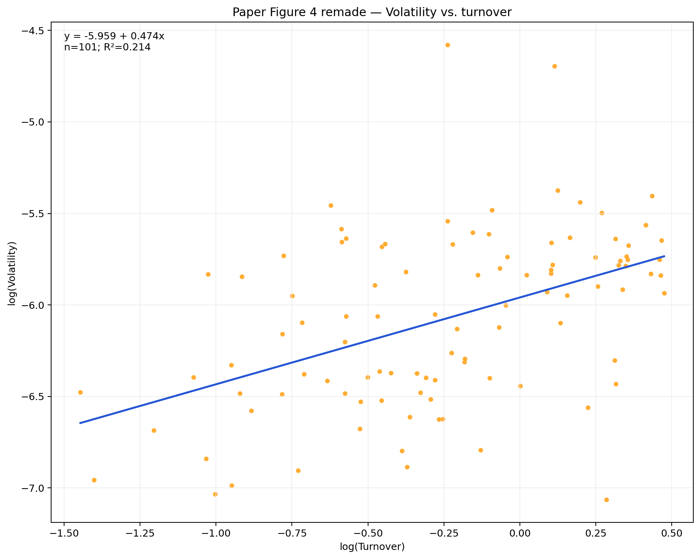

# toraniko-alpha101

An independent implementation and audit of all 101 formulaic alphas from the WorldQuant paper,
integrated with Toraniko's long-form Polars factor framework.

- Official paper: [101 Formulaic Alphas (PDF)](https://arxiv.org/pdf/1601.00991)
- Formula implementation: [`toraniko/alpha101.py`](toraniko/alpha101.py)
- Formula and neutralization audit tests: [`toraniko/tests/test_alpha101.py`](toraniko/tests/test_alpha101.py)
- PnL and IC analysis: [`toraniko/alpha101_report.py`](toraniko/alpha101_report.py)
- Reproducible report runner: [`examples/alpha101_full_market/run.py`](examples/alpha101_full_market/run.py)

This project is research software. It is not affiliated with WorldQuant and is not investment
advice. Reported returns exclude transaction costs and are not live trading results.

## Full-market Alpha101 report

Like the original paper, this report runs on a broad U.S. equity cross-section: a current-constituent
[S&P Composite 1500](https://www.spglobal.com/spdji/en/indices/equity/sp-composite-1500/) snapshot
(the S&P 500, MidCap 400, and SmallCap 600, roughly 90% of U.S. market capitalization). The
2026-07-15 snapshot contains 1,506 securities; 1,501 have complete usable Yahoo OHLCV and
historical-share histories. The analysis runs from 2023-01-03 through 2026-07-16 with warm-up data
from 2021-12-30.

Method: signals at *t*, next-session returns at *t+1*, equal-weight top/bottom quintiles, 50% long
and 50% short. Portfolio membership uses information available at *t* only; a missing next-session
return is realized as zero. Securities tied at a quintile boundary are kept together and each side
is renormalized; a constant signal holds no position. All formula-mandated sector, industry, and
subindustry neutralizations use the current GICS hierarchy.

| Statistic | This report | Paper |
|---|---:|---:|
| Maximum Sharpe | 2.120 | 4.162 |
| Median Sharpe | 0.518 | 2.224 |
| Mean Sharpe | 0.411 | 2.265 |
| Median rank IC | 0.0039 | Not reported |
| Positive-Sharpe alphas | 74/101 | 101/101 |

The strongest result is Alpha21 at a before-cost Sharpe of 2.12. This does not reproduce the paper's
entire Sharpe distribution because WorldQuant's universe, execution timing, score-to-weight
conversion, risk constraints, and selection process remain proprietary.





### Paper figures remade with current data

Figures 1-4 from the official [*101 Formulaic Alphas* paper](https://arxiv.org/pdf/1601.00991) are
reproduced with this report's data. The definitions follow Section 3 of the paper: turnover is gross
daily dollars traded per dollar of gross investment, and cents-per-share is 100 times mean daily PnL
divided by mean daily shares traded (buys plus sells).

- Mean / median pairwise alpha-return correlation: 0.1942 / 0.1711 across 5,050 pairs
- `log(Return) ~ log(Volatility)`: slope 1.857, R² 0.510, 74 positive-return alphas
- Adding `log(Turnover)` to that regression: coefficient -0.016, t-stat -0.072
- Turnover-tensor correlation model: R² 0.033 across 5,050 alpha pairs
- `log(Volatility) ~ log(Turnover)`: slope 0.474, R² 0.214









The complete results are in [`reports/full_market/alpha101_analysis.md`](reports/full_market/alpha101_analysis.md),
with the paper regressions in
[`reports/full_market/alpha101_paper_figures.md`](reports/full_market/alpha101_paper_figures.md),
the exact constituent snapshot in [`reports/full_market/universe.csv`](reports/full_market/universe.csv),
and machine-readable CSVs alongside them.

This is a current-constituent backtest and therefore has survivorship bias. Daily typical price
proxies VWAP, the four delay-0 formulas are conservatively evaluated at the next session, and all
returns exclude costs and impact.

## Reproduce the report

```bash
pip install -e .
pip install -r examples/alpha101_full_market/requirements.txt

python examples/alpha101_full_market/run.py
```

The first run downloads and caches the current S&P Composite 1500 OHLCV and historical shares, then
caches the computed Alpha101 score matrix. Later report regenerations reuse both caches.

## Implementation notes

- All 101 formulas are exposed through `factor_alpha101(...)` in a Toraniko-compatible long-form
  `date × symbol` panel.
- Fractional lookbacks follow the paper's floor convention.
- Average daily volume lookbacks remain in share-volume units, matching the current-volume inputs used by the formulas.
- Time-series ranks, rolling correlations, linear decay, conditional formulas, and warm-up
  behavior have dedicated tests.
- The formulas that prescribe sector, industry, or subindustry neutralization are checked against
  an explicit neutralization manifest.
- Daily VWAP is approximated by typical price in this report because the Yahoo daily panel does
  not contain true intraday VWAP.

For the underlying Toraniko factor-model documentation, see
[`README.toraniko.md`](README.toraniko.md).
